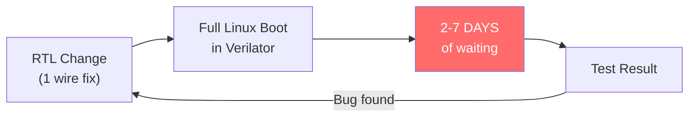
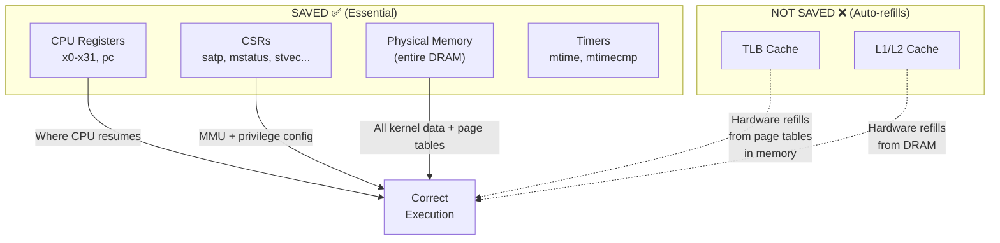
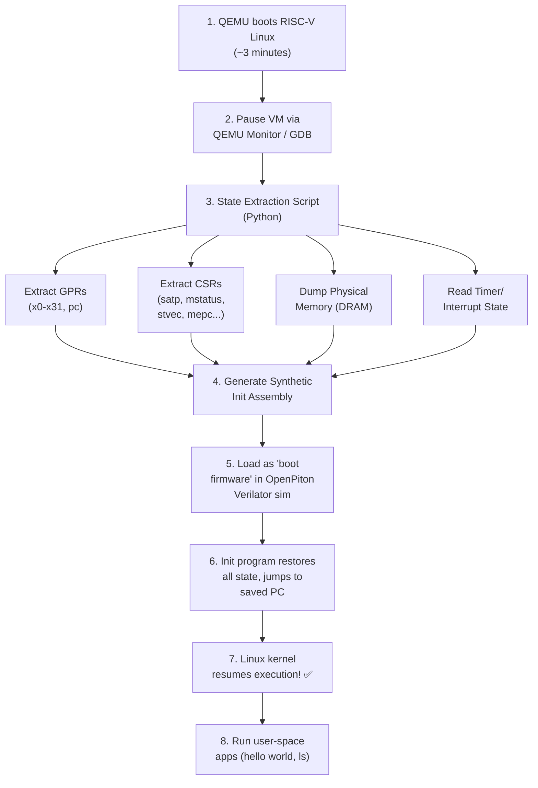
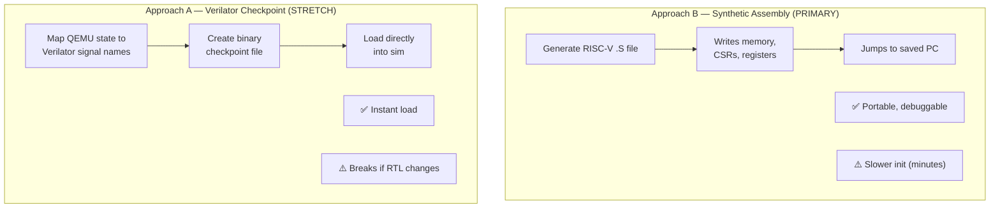
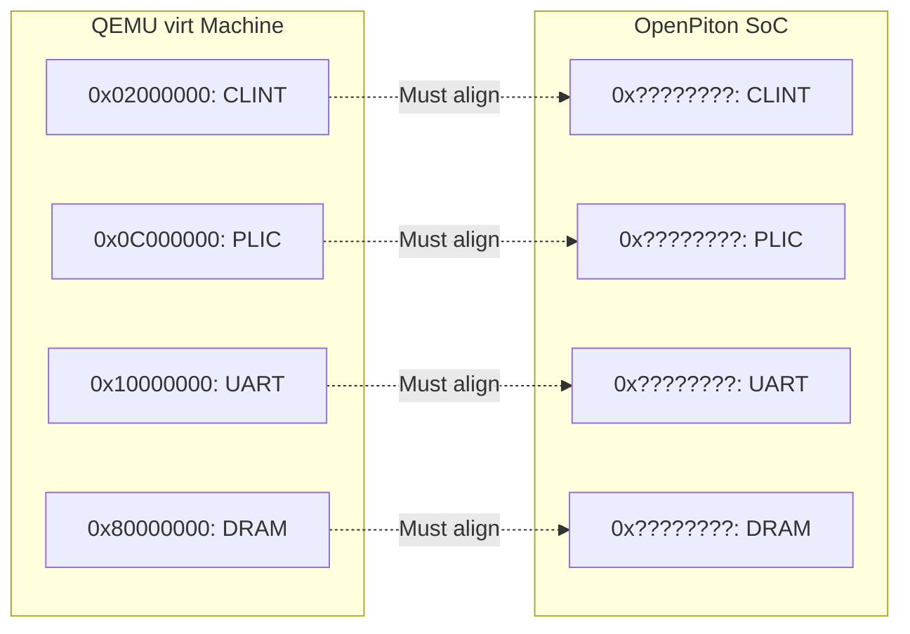
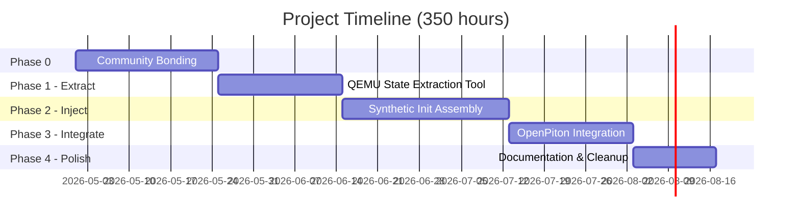
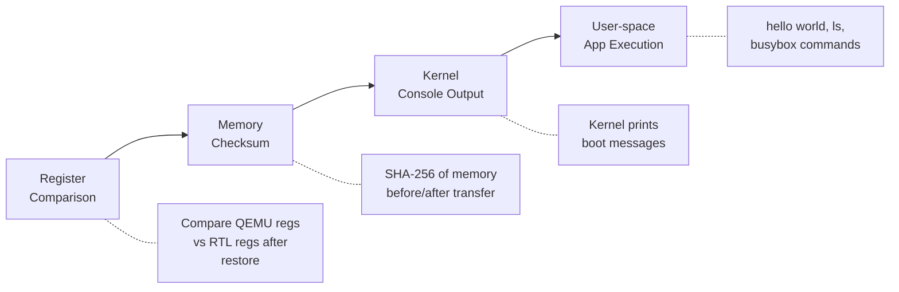

# GSoC 2026 Proposal: Generic MinimumLinuxBoot for RTL Simulations

**Organization:** FOSSi Foundation  
**Mentors:** Guillem López Paradís (BSC) & Jonathan Balkind (UCSB)  
**Contributor:** Radheshyam Modampuri (IIIT Hyderabad)  
**Duration:** 350 hours (Large)

---

## 1. The Problem



> Hardware engineers designing OpenPiton modify RTL (Verilog) and must verify their changes against a real Linux OS. But booting Linux in cycle-accurate RTL simulation takes **days to weeks** — making iterative development impractical.

---

## 2. The Solution


| | Traditional | MinimumLinuxBoot |
|---|---|---|
| Boot time | Days/Weeks | **Minutes** |
| Engineering cycles | 1–2 tests/week | **Dozens/day** |
| OS-level CI testing | Impossible | **Feasible** |

---

## 3. Technical Approach

### 3.1 What State Gets Saved (and Why)



### 3.2 End-to-End Flow



### 3.3 Two Approaches Compared



> **Strategy:** Start with Approach B (more robust, easier to debug), explore Approach A as a stretch goal.

### 3.4 Memory Map Alignment Challenge



**Solution:** Compile Linux with a custom device tree matching OpenPiton's memory map, OR adjust addresses during state transfer.

---

## 4. Timeline & Milestones



### Detailed Breakdown

| Phase | Weeks | Deliverable | Hours |
|---|---|---|---|
| **0. Community Bonding** | 1–2 | Dev environment set up, mentor alignment on approach | — |
| **1. State Extraction** | 3–5 | `qemu_state_extractor.py` — extracts GPRs, CSRs, memory from paused QEMU | 70h |
| **2. State Injection** | 6–9 | `init_benchmark.S` — RISC-V assembly that restores full machine state in RTL | 100h |
| **3. Integration** | 10–12 | End-to-end workflow in OpenPiton infra, user-space apps running after resume | 100h |
| **4. Documentation** | 13–14 | Tutorial, cleaned-up code, upstream PR | 40h |

### Midterm Checkpoint
- ✅ QEMU state extraction working
- ✅ Synthetic init benchmark loads state into RTL
- ✅ Linux kernel prints to console after resume

### Stretch Goals
- Multi-core (multi-hart) support
- Verilator checkpoint approach (Approach A)
- Performance benchmarking framework

---

## 5. Validation Plan



---

## 6. Preliminary Findings (Pre-GSoC Experiments)

I have already begun hands-on experimentation to validate the technical approach:

### Experiment 1: RISC-V Linux Boot in QEMU ✅

Successfully booted **Ubuntu 24.04 LTS** (kernel 6.17.0) on `qemu-system-riscv64 -machine virt` with OpenSBI + U-Boot.

**Boot chain observed:** OpenSBI v1.7 → U-Boot 2025.10 → Linux 6.17 → Ubuntu user-space login

### Experiment 2: CPU State Extraction via QEMU Monitor ✅

Used QEMU Monitor (`info registers`) to extract full CPU state from a running Linux system:

| Register | Extracted Value | Significance |
|---|---|---|
| `pc` | `0xffffffff80dce26e` | CPU executing in kernel virtual address space (S-mode) |
| `sp` (x2) | `0xffffffff82403d70` | Kernel stack pointer |
| `mstatus` | `0x0a000000a0` | Machine status — S-mode context, interrupts configured |
| `medeleg` | `0x00f0b559` | Page faults + ecalls delegated to S-mode (Linux handles these) |
| `mideleg` | `0x00001666` | Timer/external/software interrupts delegated to S-mode |
| `stvec` | `0xffffffff80ddba94` | Linux kernel's trap handler address |
| `mtvec` | `0x800004f8` | OpenSBI's M-mode trap handler |

### Key Discoveries

1. **`satp` CSR not available via QEMU Monitor** — requires GDB remote stub (`target remote :1234`) for extraction. This informs the tool design: the state extractor must use GDB protocol, not just the QEMU monitor.

2. **`info tlb` not supported on RISC-V in QEMU** — confirms our approach: TLB state is not extractable and not needed. Hardware page-table walks will refill TLB from the page tables already in memory.

3. **QEMU uses sv48, OpenPiton+Ariane uses Sv39** — the Linux kernel must be compiled with `CONFIG_RISCV_SV39=y` to match OpenPiton's MMU capability. This is a concrete configuration requirement identified through experimentation.

4. **Firmware base at `0x80000000`** — matches OpenPiton's expected DRAM base, which is encouraging for memory map alignment.

### Experiment 3: `satp` CSR Extraction via GDB ✅

Connected GDB to QEMU's GDB server and extracted the `satp` register:

```
satp = 0x901b600000081363
```

| Field | Value | Meaning |
|---|---|---|
| MODE (bits 63–60) | `0x9` | Sv48 — 4-level page tables |
| ASID (bits 59–44) | `0x01b6` (438) | Address Space Identifier |
| PPN (bits 43–0) | `0x00000081363` | Root page table PPN |
| **Root PT address** | **`0x81363000`** | `PPN × 4096` — physical address of root page table |

This is the single most important register for the project: it tells the MMU where the page tables live in physical memory. The synthetic init assembly would write this exact value (adjusted for Sv39) into `satp` to restore virtual memory.

### Experiment 4: Page Table Memory Dump & Decode ✅

Used QEMU's `pmemsave` to dump 4096 bytes from the root page table address (`0x81363000`) and wrote a **Python PTE decoder** to analyze the structure:

```
Root Page Table: 512 entries (4096 bytes)
├── 448 empty entries (unmapped virtual address space)
├── 6 POINTER entries → next-level page tables
└── 58 LEAF entries → direct physical memory mappings
```

Sample decoded entries:

| Index | PTE | Type | Physical Address |
|---|---|---|---|
| 71 | `0x0000e38400000001` | POINTER → Level 1 PT | `0x38e10...` |
| 167 | `0x0000e6df00000041` | POINTER → Level 1 PT | `0x39b7c...` |
| 0 | `0x000000060000a1ff` | LEAF (RWX) | `0x1800028000` |

**Tools built:** [`analyze_page_table.py`](https://github.com/radheshyam2006/gsoc26-minimumlinuxboot/blob/main/experiments/qemu-state-dump/analyze_page_table.py) — parses raw memory dumps into decoded PTEs with permissions, flags, and physical addresses.

> Full results: [experiments/qemu-state-dump/](https://github.com/radheshyam2006/gsoc26-minimumlinuxboot/tree/main/experiments/qemu-state-dump)

---

## 7. About Me

**Name:** Radheshyam Modampuri  
**University:** IIIT Hyderabad  
**Degree/Year:** Undergraduate, 3rd Year  
**GitHub:** [radheshyam2006](https://github.com/radheshyam2006)  
**Timezone:** IST (UTC+5:30)

### Relevant Skills

**Coursework:**
- Computer Architecture & Processor Design
- Operating Systems (virtual memory, page tables, system calls)
- Digital Logic Design & VLSI

**Technical Skills:**
- **HDL:** Verilog, SystemVerilog — RTL design and simulation
- **Programming:** C/C++, Python, RISC-V Assembly
- **Tools:** Vivado, Cadence, Verilator, QEMU, GDB
- **Platforms:** FPGA (Xilinx, AMD VCK5000), Linux kernel internals

**Lab & Project Experience:**
- **CVEST Lab, IIIT Hyderabad** — Building self-adaptive hardware systems, implementing ML models in RTL, FPGA emulation
- **RISC-V Designs** — Prior work on RISC-V-based processor designs
- **AMD VCK5000** — Acceleration of RAG workloads on FPGA platform
- **ML-in-Hardware** — Training ML models and deploying inference pipelines in synthesizable RTL

### Pre-GSoC Work
- [x] Booted RISC-V Linux in QEMU (Ubuntu 24.04, rv64, sv48)
- [x] Extracted CPU state via QEMU Monitor (registers, CSRs)
- [x] Extracted `satp` CSR via GDB — root page table at `0x81363000`
- [x] Dumped and decoded root page table (512 PTEs, 6 pointers, 58 leaves)
- [x] Built prototype tools: `extract_state.py`, `analyze_page_table.py`
- [x] Communicated with mentors (email + LinkedIn)
- [ ] Reboot with Sv39 kernel config for OpenPiton compatibility
- [ ] Build OpenPiton in Verilator

---

## 8. Why This Project?

This project sits at the exact intersection of my two deepest interests: **processor architecture** and **operating systems**. At the CVEST lab, I work on the hardware side — writing RTL, synthesizing designs, testing on FPGAs. But I've always been curious about the software that runs on top: how does Linux configure page tables? What does the kernel expect from the hardware at boot? This project forces me to understand both sides deeply, and I find that challenge genuinely exciting.

What drew me specifically to MinimumLinuxBoot is the **practical impact**. Hardware verification is a real bottleneck — I've seen firsthand how long simulation runs take. The idea that we can boot Linux in QEMU in 3 minutes and then skip days of RTL simulation by injecting saved state is elegant and immediately useful. This isn't a theoretical exercise; it's infrastructure that real engineers at real chip companies would benefit from. The fact that I could build something during GSoC that gets merged into OpenPiton and saves researchers weeks of time — that motivates me more than any coursework project ever has.

Finally, I'm drawn to the **open-source silicon movement**. Projects like OpenPiton, RISC-V, and FOSSi are democratizing chip design. Contributing to this ecosystem — building tools that help the community verify hardware faster — is exactly the kind of work I want to be doing as I start my career in hardware engineering.

## 9. Challenges & Risks

| Challenge | Risk Level | Mitigation |
|---|---|---|
| **Sv48 vs Sv39 mismatch** | High | QEMU defaults to Sv48 (4-level PT), but OpenPiton+Ariane supports only Sv39 (3-level). **Solution:** Compile the Linux kernel with `CONFIG_RISCV_SV39=y` so page tables are Sv39-compatible from the start. *Note: My initial experiments used sv48 (QEMU default) to validate the extraction approach. The final pipeline will use sv39.* |
| **Memory map mismatch** | High | QEMU `virt` and OpenPiton may have different peripheral addresses (UART, PLIC, CLINT). **Solution:** Use a custom device tree matching OpenPiton's layout, or remap addresses during state transfer. |
| **`satp` not in QEMU Monitor** | Medium | Discovered during Experiment 3 — QEMU Monitor doesn't expose `satp` on RISC-V. **Solution:** Already solved — use GDB remote stub instead. |
| **OpenPiton build complexity** | Medium | OpenPiton uses a mix of Verilog, Perl, Python, and specific toolchain requirements. **Solution:** Start early during community bonding, document build steps. |
| **Cold TLB/cache performance** | Low | After state restore, TLB and caches are empty. **Not a correctness issue** — hardware auto-refills via page table walks. Brief performance warmup (~microseconds), then normal speed. |
| **Approach B init time** | Low | Synthetic assembly must execute instructions to write all state. May take minutes in RTL sim. **Acceptable** — still orders of magnitude faster than full boot (days → minutes). |

### Fallback Plan

If Approach B (synthetic assembly) proves too slow for large memory images:
1. First try: Compress memory image and use a minimal decompression loop in the init assembly
2. Second try: Use Verilator's `--savable` checkpoint format (Approach A) as a faster alternative
3. Third try: Hybrid — use synthetic assembly for registers/CSRs, but load memory via Verilator's `$readmemh`

---

## References

1. [RISC-V Privileged Specification](https://riscv.org/specifications/privileged-isa/)
2. [OpenPiton](https://github.com/PrincetonUniversity/openpiton)
3. [Verilator User Guide](https://verilator.org/guide/latest/)
4. [QEMU RISC-V](https://www.qemu.org/docs/master/system/riscv/virt.html)
5. [OpenSBI](https://github.com/riscv-software-src/opensbi)
6. [Pre-GSoC Experiments Repository](https://github.com/radheshyam2006/gsoc26-minimumlinuxboot)
