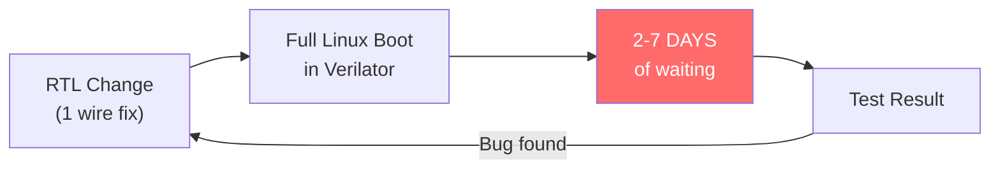
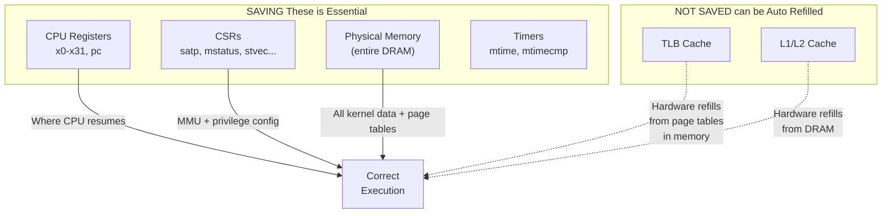
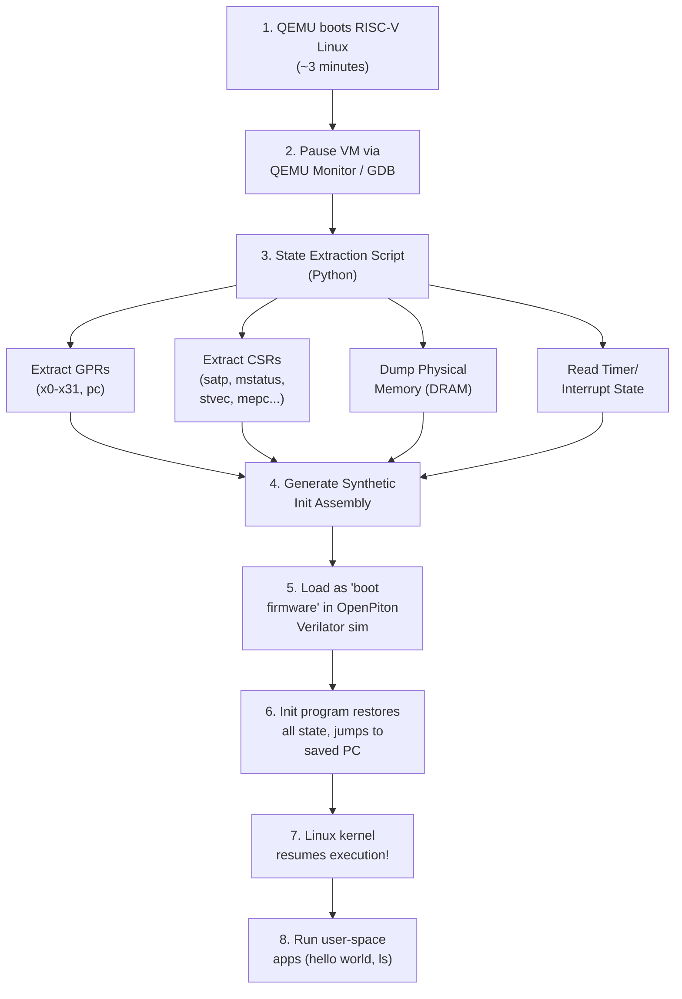
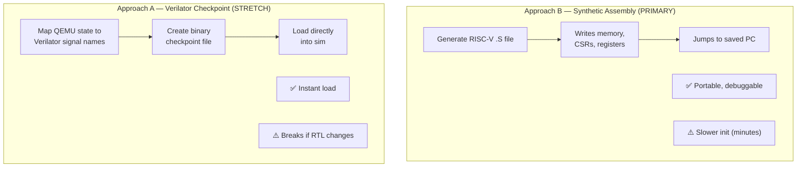
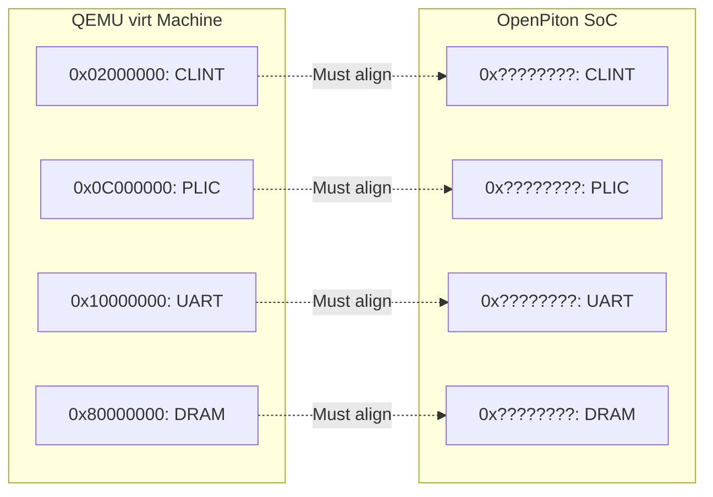
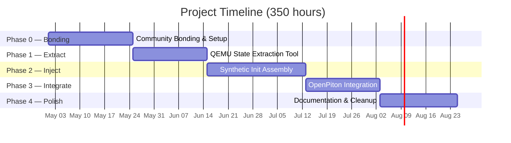
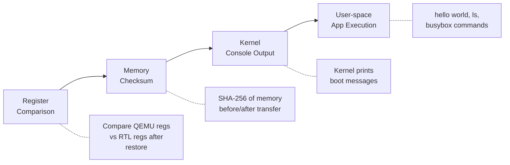

# GSoC 2026 Proposal: Generic MinimumLinuxBoot for RTL Simulations

**Organization:** FOSSi Foundation  
**Mentors:** Guillem López Paradís (BSC) & Jonathan Balkind (UCSB)  
**Contributor:** Radheshyam Modampuri (IIIT Hyderabad)  
**Duration:** 350 hours (Large)

---

## 1. The Problem



> Hardware engineers designing OpenPiton modify the RTL (Verilog), they must verify their changes against a real Linux OS to check if the changes are correct. But booting Linux in cycle-accurate RTL simulation takes **days to weeks** — making iterative development impractical.

The goal is to boot Linux in minutes using QEMU, save the complete machine state, and inject it into the Verilator RTL simulation — so the RTL sim starts with Linux *already running*.

The second part of the project is adding the necessary support in OpenPiton's simulation infrastructure to continue execution from the injected state and being able to launch user-space applications (e.g., `hello world`, `ls`, busybox) inside the resumed Linux system.


---

## 2. The Solution


| | Traditional | MinimumLinuxBoot |
|---|---|---|
| Boot time | Days/Weeks | **Minutes** |
| Testing Time | 1–2 tests/week | **Dozens/day** |
| OS-level CI testing | Impossible | **Feasible** |

---

## 3. Technical Approach

### 3.1 What State Gets Saved (and Why)



#### Why we need to save These is 

**CPU Registers (x0–x31, pc):**
The general purpose registers will hold the kernel's live computation state like  function arguments, return addresses, stack pointers, and the program counter (`pc`) that tells the CPU *exactly* where to resume execution. Without restoring these, the kernel would start at the wrong instruction with garbage data in its registers, causing an immediate crash. The `pc` in particular points into the kernel's virtual address space (e.g., `0xffffffff80xxxxxx`), so it only makes sense once the MMU is also configured correctly (high amount of address space is in virtual memory).

**Control and Status Registers (CSRs):**
CSRs configure the CPU's privileged execution environment. The most critical is `satp`, which points the MMU to the root page table in physical memory — without it, virtual memory is disabled and every kernel address fault. `mstatus` controls the privilege mode (M/S/U) and interrupt enable bits; `stvec` tells the CPU where to jump on a trap (page fault, syscall, timer interrupt); `medeleg`/`mideleg` control which exceptions and interrupts are handled by S-mode (Linux) vs M-mode (OpenSBI). If any of these are wrong, the kernel either crashes on the first trap or runs at the wrong privilege level.

**Physical Memory (entire DRAM):**
Physical memory contains *everything* the kernel needs: the page tables that `satp` points to, the kernel's code and data segments, all allocated kernel structures (process table, file descriptors, slab caches), and any user-space programs loaded before the snapshot. Page tables are just data structures *in memory* — saving `satp` without saving the memory it points to is useless. This is the largest piece of state (~128 MB–1 GB) and dominates the transfer time.

**Timers (mtime, mtimecmp):**
The RISC-V timer (`mtime`) is like kernel's heartbeat (clock tick) — Linux uses it for scheduling, timeouts, and `jiffies`. `mtimecmp` is the comparator that triggers the next timer interrupt. If `mtimecmp` is left at zero after restore, a timer interrupt fires immediately (possibly before the kernel is ready), causing a crash or hang. Setting it correctly lets the kernel resume its normal scheduling tick.

#### Why These Are NOT Saved

**TLB (Translation Lookaside Buffer):**
The TLB is a hardware cache of recent virtual-to-physical address translations. It is **not architecturally visible** — there is no RISC-V instruction to read or write individual TLB entries. When the CPU encounters a virtual address not in the TLB (a TLB miss), it automatically performs a **hardware page-table walk**, reading the page tables from physical memory to fill the TLB entry. Since we restore the full page tables in DRAM, the TLB will refill itself correctly on demand. The only cost is a brief warmup period (microseconds) as the first accesses trigger page walks instead of TLB hits.

**L1/L2 Caches:**
Caches are transparent hardware optimizations — they hold copies of data that also exists in DRAM. After a cold start, every memory access is a cache miss that fetches data from DRAM and populates the cache line automatically. Since we restore the full DRAM contents, caches will warm up naturally. Like the TLB, this causes a brief performance dip but has **zero correctness impact**.

### 3.2 End-to-End Flow



### 3.3 Two Approaches Compared



**Approach B (Synthetic Assembly)** is our primary approach: a Python script generates a RISC-V `.S` assembly file that contains all the extracted state as hardcoded values. When this assembly runs inside the Verilator RTL sim, it writes each register, each CSR, and fills memory with the saved contents — then jumps to the saved `pc` to resume Linux. This is **portable** (works with any RTL, no dependency on Verilator internals) and **debuggable** (you can step through the assembly and see exactly what's being restored). The trade-off is speed: writing ~128 MB of memory instruction-by-instruction may take **10–30 minutes** in RTL simulation — but this is still orders of magnitude faster than the 2–7 days of a full boot.

**Approach A (Verilator Checkpoint)** directly maps QEMU state to Verilator's internal signal names and creates a binary checkpoint file using Verilator's `--savable` feature. This would load **almost instantly** but is **fragile** — any change to RTL signal names, module hierarchy, or Verilator version would break the checkpoint format. The signal name mapping must also be maintained manually. This approach also changes if the RTL names or structure changes, making it impractical for active development where RTL is being modified frequently.

**Estimated time comparison:**
| | Approach B (Synthetic Assembly) | Approach A (Verilator Checkpoint) |
|---|---|---|
| State injection time | ~10–30 min in RTL sim | ~seconds (binary load) |
| Setup effort | Medium (generate assembly) | High (map every signal name) |
| Maintenance | None — ISA is stable | Must update on any RTL change |
| Portability | Works with any simulator | Verilator-specific |

> **Strategy:** Start with Approach B (more robust, easier to debug), explore Approach A as a stretch goal.

### 3.4 Memory Map Alignment Challenge



**The Challenge:** When Linux boots in QEMU, it reads the device tree to learn where peripherals are. If QEMU says "UART is at `0x10000000`" but OpenPiton puts UART at a different address, the kernel's UART driver will read/write to the wrong address after state transfer — causing I/O failures.

**Solution — Custom Device Tree:** We compile Linux inside QEMU using a **custom device tree (`.dtb`)** that matches OpenPiton's actual peripheral layout (from `piton/verif/env/manycore/devices_ariane.xml`). This way, when the kernel boots in QEMU, it already uses the correct addresses — and those same addresses work in OpenPiton.

**Additionally — Sv39 mode:** The Linux kernel must be compiled with `CONFIG_RISCV_SV39=y` so it uses 3-level page tables compatible with Ariane's MMU. This is a kernel build config, not a QEMU setting — QEMU supports both Sv39 and Sv48, and the kernel chooses which to use. Combined with the custom device tree, these two changes make the QEMU-booted state fully compatible with OpenPiton.

**Good news:** DRAM base already matches — both QEMU `virt` and OpenPiton+Ariane use `0x80000000`. This is the largest and most critical region.

---

## 4. Timeline & Milestones



### Detailed Breakdown

subjected to change according to my exams and almanac of collage will update it,
will update with dates also 


| Phase | Weeks | Deliverable | Hours |
|---|---|---|---|
| **0. Community Bonding** | 1–2 | Dev environment set up, mentor alignment on approach | — |
| **1. State Extraction** | 3–5 | `qemu_state_extractor.py` — extracts GPRs, CSRs, memory from paused QEMU | 70h |
| **2. State Injection** | 6–9 | `init_benchmark.S` — RISC-V assembly that restores full machine state in RTL | 100h |
| **3. Integration** | 10–12 | End-to-end workflow in OpenPiton infra, user-space apps running after resume | 100h |
| **4. Documentation** | 13–14 | Tutorial, cleaned-up code, upstream PR | 40h |

### Midterm Checkpoint
- ✅ QEMU state extraction working
- ✅ Synthetic init benchmark loads state into RTL
- ✅ Linux kernel prints to console after resume

### Stretch Goals
- Multi-core (multi-hart) support
- Verilator checkpoint approach (Approach A)
- Performance benchmarking framework

---

## 5. Validation Plan



The validation is a **4-level progression** — each level builds on the previous one:

1. **Register Comparison:** After injecting state into Verilator, read back all 32 GPRs + `pc` + critical CSRs and compare them byte-for-byte with the QEMU dump. If these don't match, the injection mechanism itself is broken.

2. **Memory Checksum:** Compute SHA-256 of the DRAM dump from QEMU, then compute the same hash over Verilator's memory after loading. This confirms >100 MB of data transferred correctly without any bit errors.

3. **Kernel Console Output:** Resume execution and check if Linux prints messages to the UART (serial console). If we see kernel log output, it means the CPU is executing, the MMU is translating virtual addresses correctly, and the UART driver is working — Linux is alive.

4. **User-space App Execution:** Run pre-loaded programs (`hello world`, `ls`, busybox commands). If these work, it proves the entire stack — CPU, MMU, interrupts, scheduler, system calls, filesystem — is functional in RTL.

---

## 6. Preliminary Findings (Pre-GSoC Experiments)

I have already begun hands-on experimentation to validate the technical approach:

### Experiment 1: RISC-V Linux Boot in QEMU ✅

Successfully booted **Ubuntu 24.04 LTS** (kernel 6.17.0) on `qemu-system-riscv64 -machine virt` with OpenSBI + U-Boot.

**Boot chain observed:** OpenSBI v1.7 → U-Boot 2025.10 → Linux 6.17 → Ubuntu user-space login

### Experiment 2: CPU State Extraction via QEMU Monitor ✅

Used QEMU Monitor (`info registers`) to extract full CPU state from a running Linux system:

| Register | Extracted Value | Significance |
|---|---|---|
| `pc` | `0xffffffff80dce26e` | CPU executing in kernel virtual address space (S-mode) |
| `sp` (x2) | `0xffffffff82403d70` | Kernel stack pointer |
| `mstatus` | `0x0a000000a0` | Machine status — S-mode context, interrupts configured |
| `medeleg` | `0x00f0b559` | Page faults + ecalls delegated to S-mode (Linux handles these) |
| `mideleg` | `0x00001666` | Timer/external/software interrupts delegated to S-mode |
| `stvec` | `0xffffffff80ddba94` | Linux kernel's trap handler address |
| `mtvec` | `0x800004f8` | OpenSBI's M-mode trap handler |

### Key Findings

1. **`satp` CSR not available via QEMU Monitor** — requires GDB remote stub (`target remote :1234`) for extraction. This informs the tool design: the state extractor must use GDB protocol, not just the QEMU monitor.

2. **`info tlb` not supported on RISC-V in QEMU** — confirms our approach: TLB state is not extractable and not needed. Hardware page-table walks will refill TLB from the page tables already in memory.

3. **QEMU uses sv48, OpenPiton+Ariane uses Sv39** — the Linux kernel must be compiled with `CONFIG_RISCV_SV39=y` to match OpenPiton's MMU capability. This is a concrete configuration requirement identified through experimentation.

4. **Firmware base at `0x80000000`** — matches OpenPiton's expected DRAM base, which is encouraging for memory map alignment.

### Experiment 3: `satp` CSR Extraction via GDB ✅

Connected GDB to QEMU's GDB server and extracted the `satp` register:

```
satp = 0x901b600000081363
```

| Field | Value | Meaning |
|---|---|---|
| MODE (bits 63–60) | `0x9` | Sv48 — 4-level page tables |
| ASID (bits 59–44) | `0x01b6` (438) | Address Space Identifier |
| PPN (bits 43–0) | `0x00000081363` | Root page table PPN |
| **Root PT address** | **`0x81363000`** | `PPN × 4096` — physical address of root page table |

This is the single most important register for the project: it tells the MMU where the page tables live in physical memory. The synthetic init assembly would write this exact value (adjusted for Sv39) into `satp` to restore virtual memory.

### Experiment 4: Page Table Memory Dump & Decode ✅

Used QEMU's `pmemsave` to dump 4096 bytes from the root page table address (`0x81363000`) and wrote a **Python PTE decoder** to analyze the structure:

```
Root Page Table: 512 entries (4096 bytes)
├── 448 empty entries (unmapped virtual address space)
├── 6 POINTER entries → next-level page tables
└── 58 LEAF entries → direct physical memory mappings
```

Sample decoded entries:

| Index | PTE | Type | Physical Address |
|---|---|---|---|
| 71 | `0x0000e38400000001` | POINTER → Level 1 PT | `0x38e10...` |
| 167 | `0x0000e6df00000041` | POINTER → Level 1 PT | `0x39b7c...` |
| 0 | `0x000000060000a1ff` | LEAF (RWX) | `0x1800028000` |

**Tools built:** [`analyze_page_table.py`](https://github.com/radheshyam2006/gsoc26-minimumlinuxboot/blob/main/experiments/qemu-state-dump/analyze_page_table.py) — parses raw memory dumps into decoded PTEs with permissions, flags, and physical addresses.

### Experiment 5: RTL Compilation & Toolchain Alignment ✅

Successfully built the OpenPiton cycle-accurate RTL model (`Vcmp_top`) using Verilator and resolved severe modern toolchain incompatibilities.

**Verilator & Bison Conflict:**
- Identified that Verilator 5.x breaks OpenPiton's C++ linking due to Precompiled Header (PCH) changes and unsupported `#1` timing delays. 
- Downgraded to Verilator 4.014 for stability.
- Ubuntu 24.04 ships with Bison 3.8+, which fails to build Verilator 4.014. **Resolution:** Manually compiled Bison 3.5.1 from source to successfully build the exact Verilator version required by OpenPiton.

**Modern RISC-V GCC (13+) Strictness:**
- The standard Ubuntu `apt` packages lacked the Newlib C library (`string.h`). **Resolution:** Migrated to the professional standalone **xPack RISC-V Toolchain (v15.2.0-1)**.
- Modern GCC strictly requires the `_zicsr` architecture extension for CSR instructions, causing OpenPiton's `riscv-tests` benchmarks to fail. **Resolution:** Wrote a Python patch script (`patch_riscv_tests.py`) to surgically insert `-march=rv64gc_zicsr` into the test Makefiles and suppress implicit C warnings for older benchmark code (Dhrystone).

> Full results: [experiments/qemu-state-dump/](https://github.com/radheshyam2006/gsoc26-minimumlinuxboot/tree/main/experiments/qemu-state-dump)

---

## 7. About Me

**Name:** Radheshyam Modampuri  
**University:** IIIT Hyderabad (3rd Year, B.Tech ECE)  
**GitHub:** [radheshyam2006](https://github.com/radheshyam2006)  
**Email:** radheshyam.modampuri@students.iiit.ac.in  
**Timezone:** IST (UTC+5:30)

### Relevant Skills

I work at the **CVEST Lab** (Center for VLSI and Embedded Systems Technologies) at IIIT Hyderabad, where my daily work involves writing Verilog, running synthesis, and testing designs on FPGAs. Here is what I bring to this project:

- **HDL & RTL Design:** I write Verilog regularly — simulating, synthesizing, and debugging hardware modules is something I do most weeks in lab. And currently I am working on self aware circuits basicaly writing ml models rtl to make asic(application is compensation of pvt variation in analog circuits).
- **RISC-V:** I have worked on RISC-V processor designs as part of my coursework and understand the ISA, pipeline stages, and privilege modes.
- **FPGA:** Real hardware experience on Xilinx FPGAs(xynq board for ml models for compensation of pvt variation in analog circuits) and the AMD VCK5000 platform, where I worked on accelerating RAG workloads(matrix multiplacation parlalising processe across multiple Tiles).
- **Systems Software:** Comfortable with C/C++, Python, Linux internals, GDB debugging, and shell scripting.
- **ML-in-Hardware:** Built inference pipelines in synthesizable RTL — this taught me how to bridge algorithm design and hardware constraints.

**Relevant Courses:** Computer Architecture, Operating Systems (virtual memory, page tables, TLB), Digital Logic Design, VLSI.

### What I Have Already Done (Pre-GSoC)

- [x] Booted RISC-V Linux in QEMU (Ubuntu 24.04, rv64, sv48)
- [x] Extracted CPU state via QEMU Monitor (registers, CSRs)
- [x] Extracted `satp` CSR via GDB — found root page table at `0x81363000`
- [x] Dumped root page table memory and decoded all 512 PTEs
- [x] Built prototype tools: `extract_state.py`, `analyze_page_table.py`
- [x] Identified and patched `--no-timing` issue for Verilator 5.x, before identifying Verilator 4.014 as the recommended version
- [x] Successfully built Verilator 4.014 from source (required diagnosing a build failure and compiling Bison 3.5.1 from source to resolve incompatibilities with Bison 3.8.x)
- [ ] Successfully built OpenPiton with Verilator simulation using the custom-built version 4.014 (still going on)
- [ ] Reboot with Sv39 kernel config for OpenPiton compatibility

---

## 8. Why This Project?

<!-- NOTE TO SELF: rewrite this in my own words before submission -->

I picked this project because it connects two things I actually care about — hardware design and the OS that runs on it. In my lab at IIIT Hyderabad, I write RTL and test it on FPGAs. But I have always wondered: what happens when Linux actually boots on the hardware I design? How does the kernel set up page tables? What does `satp` actually look like in a running system? This project gives me a reason to figure that out for real, not just in a textbook.

The other thing that got me interested is how practical it is. When I read the project description and understood that RTL simulation takes days just to boot Linux, and that this project could bring that down to minutes — I immediately wanted to work on it. That is a real problem with a real solution. If this tool works, it does not just help one person — it helps every researcher using OpenPiton.Like a golden solution for them who works on computer architecture.

I also like that this project lives in the open-source RISC-V ecosystem. I want to contribute to something that the community actually uses, not just a semester project that sits on a hard drive.

## 8.1 Why Choose Me?

I have already done more pre-GSoC work than most applicants would. Before writing this proposal, I:
- Booted RISC-V Linux in QEMU and extracted real CPU state
- Figured out on my own that `satp` is not in QEMU Monitor and used GDB instead
- Dumped physical memory and decoded page table entries using tools I wrote (a bit AI help is there)
- Successfully built Verilator from source and compiled the OpenPiton simulation models, proactively overcoming toolchain incompatibilities (Bison 3.8.x vs Verilator 4.014) by building older dependencies from source.

I did not just read about these things — I ran them, hit errors, fixed them, documented each step, and pushed everything to GitHub. I think that shows I can work independently and figure things out when something breaks.

My lab experience at CVEST means I am comfortable with the full hardware workflow — RTL, synthesis, FPGA, debugging. And I am genuinely excited about this project, not just applying because it exists.

## 8.2 Availability

- **Community Bonding (May 1–24):** Fully available. No exams during this period.
- **Coding Period (May 25–Aug 25):** I can commit **30–35 hours/week** during summer.
- **Exam Conflicts:** <!-- TODO: fill in your exam dates here --> I will adjust my schedule around any mid-term exams and communicate this with mentors in advance.
- **Communication:** Available daily on Gitter/email. Comfortable with weekly video calls for sync-ups.
- **Post-GSoC:** I plan to stay involved with OpenPiton and maintain the tools I build.

## 9. Challenges & Risks

| Challenge | Risk Level | Mitigation |
|---|---|---|
| **Sv48 vs Sv39 mismatch** | High | QEMU defaults to Sv48 (4-level PT), but OpenPiton+Ariane supports only Sv39 (3-level). **Solution:** Compile the Linux kernel with `CONFIG_RISCV_SV39=y` so page tables are Sv39-compatible from the start. *Note: My initial experiments used sv48 (QEMU default) to validate the extraction approach. The final pipeline will use sv39.* |
| **Memory map mismatch** | High | QEMU `virt` and OpenPiton may have different peripheral addresses (UART, PLIC, CLINT). **Solution:** Use a custom device tree matching OpenPiton's layout, or remap addresses during state transfer. |
| **`satp` not in QEMU Monitor** | Medium | Discovered during Experiment 3 — QEMU Monitor doesn't expose `satp` on RISC-V. **Solution:** Already solved — use GDB remote stub instead. |
| **OpenPiton build complexity** | Medium | OpenPiton uses a mix of Verilog, Perl, Python, and specific toolchain requirements. **Solution:** Start early during community bonding, document build steps. |
| **Cold TLB/cache performance** | Low | After state restore, TLB and caches are empty. **Not a correctness issue** — hardware auto-refills via page table walks. Brief performance warmup (~microseconds), then normal speed. |
| **Approach B init time** | Low | Synthetic assembly must execute instructions to write all state. May take minutes in RTL sim. **Acceptable** — still orders of magnitude faster than full boot (days → minutes). |

### Fallback Plan

If Approach B (synthetic assembly) proves too slow for large memory images:
1. First try: Compress memory image and use a minimal decompression loop in the init assembly
2. Second try: Use Verilator's `--savable` checkpoint format (Approach A) as a faster alternative
3. Third try: Hybrid — use synthetic assembly for registers/CSRs, but load memory via Verilator's `$readmemh`

---

## References

1. [hhp3 — RISC-V Virtual Memory (Sv39, Sv48, Sv57) YouTube Series](https://www.youtube.com/playlist?list=PL3by7evD3F51cIHBBmhfLznL-OYOyEGAu) — Excellent video lectures on RISC-V virtual memory that greatly helped my understanding of page tables and address translation
2. [RISC-V Privileged Specification v20211203](https://riscv.org/specifications/privileged-isa/) — Chapters 4 (Sv39/Sv48 paging), 3 (Machine-level CSRs)
3. J. Balkind et al., ["OpenPiton: An Open Source Manycore Research Framework,"](https://parallel.princeton.edu/papers/openpiton-asplos16.pdf) ASPLOS 2016
4. [OpenPiton — Princeton Parallel Group](https://github.com/PrincetonUniversity/openpiton)
5. [CVA6 (Ariane) RISC-V Core](https://github.com/openhwgroup/cva6) — The CPU core used in OpenPiton's RISC-V configuration
6. [CVA6 User Manual](https://docs.openhwgroup.org/projects/cva6-user-manual/) — Documents Sv39 MMU, pipeline, and configuration options
7. [Verilator User Guide](https://verilator.org/guide/latest/) — `--savable` checkpoint mechanism (Section 11)
8. [QEMU RISC-V virt Machine](https://www.qemu.org/docs/master/system/riscv/virt.html) — Memory map, device tree structure
9. [OpenSBI — RISC-V Open Source Supervisor Binary Interface](https://github.com/riscv-software-src/opensbi)
10. A. Waterman, K. Asanović, "The RISC-V Instruction Set Manual, Volume II: Privileged Architecture," v20211203
11. [Pre-GSoC Experiments Repository](https://github.com/radheshyam2006/gsoc26-minimumlinuxboot)
