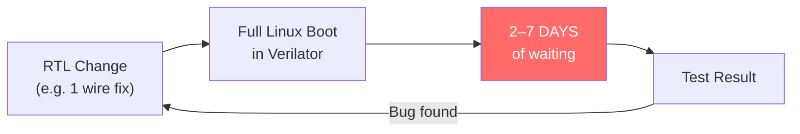
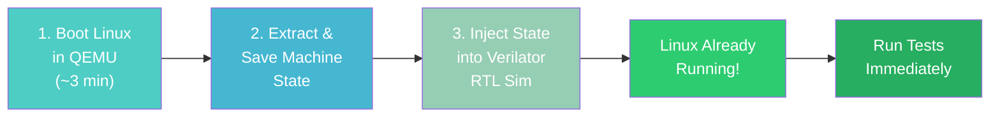
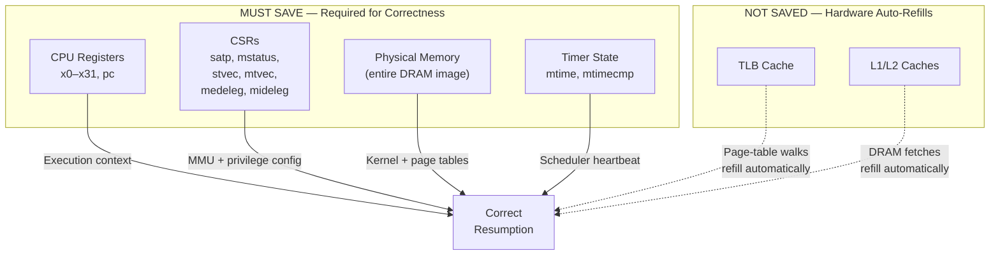
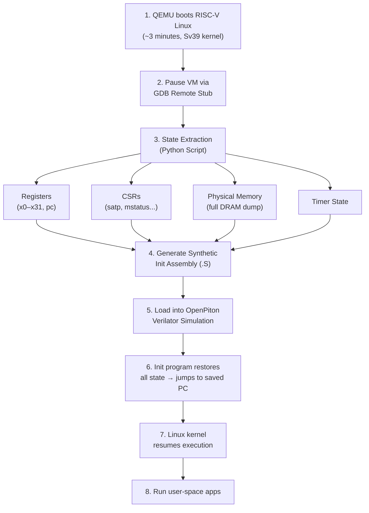
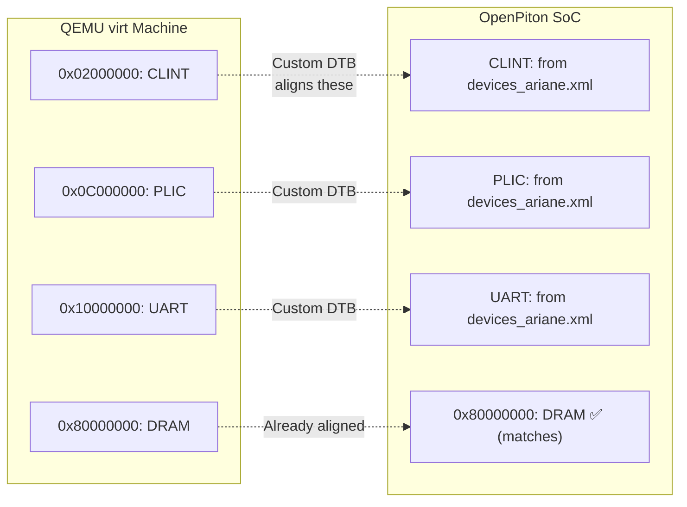
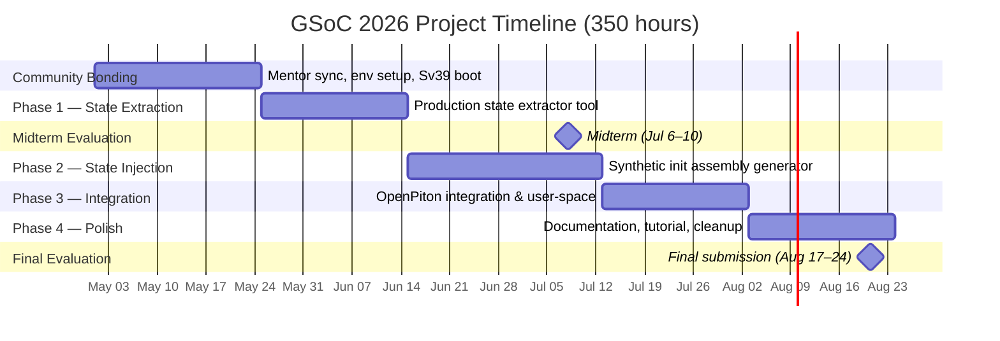
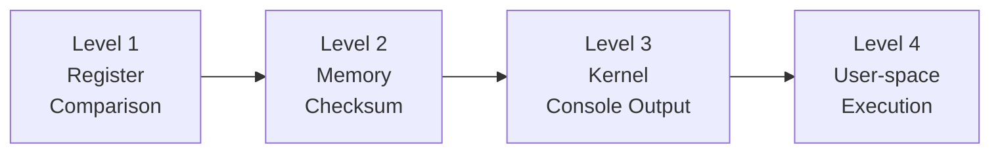

# ─────────────────────────────────────────────────────────
# COVER PAGE
# ─────────────────────────────────────────────────────────

<!-- Logos: FOSSi Foundation · Google Summer of Code -->
<!-- [FOSSi Foundation Logo]   [Google Summer of Code Logo] -->

 

# Google Summer of Code 2026

## FOSSi Foundation

  

# Generic MinimumLinuxBoot for RTL Simulations

### *Fast-forwarding Linux Boot in Cycle-Accurate Hardware Simulation*

  

**Radheshyam Modampuri**

3rd Year B.Tech, Electronics & Communication Engineering

**IIIT Hyderabad** — International Institute of Information Technology

<!-- [IIIT Hyderabad Logo] -->

 

📧 radheshyam180206@gmail.com

📱 +91 9392182006

🔗 [github.com/radheshyam2006](https://github.com/radheshyam2006)

 

**Mentors:** Dr. Guillem López Paradís (BSC) & Prof. Jonathan Balkind (UCSB)

**Duration:** 350 hours (Large Project)

**Submission Date:** March 2026

---

# Table of Contents

1. [Problem Statement & Motivation](#1-problem-statement--motivation)
2. [Proposed Solution](#2-proposed-solution)
3. [Technical Approach](#3-technical-approach)
   - 3.1 [State Identification & Extraction](#31-state-identification--extraction)
   - 3.2 [End-to-End Pipeline](#32-end-to-end-pipeline)
   - 3.3 [Primary Approach: Synthetic Init Assembly](#33-primary-approach-synthetic-init-assembly)
   - 3.4 [Memory Map Alignment](#34-memory-map-alignment)
4. [Timeline & Milestones](#4-timeline--milestones)
5. [Technical Risks & Mitigation](#5-technical-risks--mitigation)
6. [Validation Plan](#6-validation-plan)
7. [Pre-GSoC Contributions](#7-pre-gsoc-contributions)
8. [Work Sharing & Communication](#8-work-sharing--communication)
9. [About Me](#9-about-me)
10. [References](#10-references)

---

## 1. Problem Statement & Motivation

Hardware engineers working on OpenPiton must verify their RTL changes against a real Linux operating system. The standard approach — booting Linux from scratch inside a cycle-accurate Verilator simulation — takes **2 to 7 days** per iteration. This makes iterative development and regression testing practically impossible.

Every small change — even fixing a single wire — requires waiting days before the engineer can observe whether Linux boots correctly. This bottleneck is well understood in the computer architecture community, but few generic solutions exist for open-source SoC platforms like OpenPiton.

**The opportunity:** QEMU can boot the same RISC-V Linux kernel in approximately **3 minutes** using software emulation. If we can capture the complete machine state from QEMU after boot and inject it into the RTL simulation, the Verilator simulation can begin with Linux *already running* — reducing the turnaround from **days to minutes**.

---

## 2. Proposed Solution

The MinimumLinuxBoot approach works in three phases:

| Metric | Traditional Boot | MinimumLinuxBoot |
|---|---|---|
| Linux boot time in RTL | Days–Weeks | **Minutes** |
| Testing throughput | 1–2 tests/week | **Dozens/day** |
| OS-level CI/regression | Impractical | **Feasible** |

The second part of the project adds the necessary support in OpenPiton's simulation infrastructure to continue execution from the injected state, enabling user-space applications (e.g., `hello world`, `ls`, busybox) to run inside the resumed Linux system.

---

## 3. Technical Approach

### 3.1 State Identification & Extraction

The first step is identifying *which* machine state must be saved and restored for Linux to resume correctly. Through my pre-GSoC experiments (Section 7), I have validated the following decomposition:

**Why each matters:**
- **CPU Registers (x0–x31, pc):** Hold the kernel's live computation state — function arguments, stack pointer, return addresses — and the exact instruction to resume at.
- **CSRs:** Configure the CPU's privileged environment. `satp` points the MMU to the root page table; `mstatus` controls privilege mode; `stvec` is the kernel's trap handler; `medeleg`/`mideleg` control exception delegation to S-mode.
- **Physical Memory:** Contains everything — page tables, kernel code/data, process structures, and pre-loaded user-space programs. Saving `satp` without the memory it points to is useless.
- **Timers:** Linux's scheduling heartbeat. If `mtimecmp` is left at zero, a premature timer interrupt can crash the kernel before it stabilizes.

**TLB and caches** are *not* architecturally visible on RISC-V and auto-refill from memory via hardware page-table walks. This causes a brief warmup period (microseconds) but has **zero correctness impact**.

### 3.2 End-to-End Pipeline

### 3.3 Primary Approach: Synthetic Init Assembly

Two approaches are viable. We will pursue **Approach B as the primary** strategy:

**Approach B — Synthetic Assembly (Primary):** A Python script generates a RISC-V assembly file (`.S`) encoding all extracted state as hardcoded values. When this assembly runs inside the Verilator RTL simulation, it programs each CSR, loads registers, fills memory with saved contents, and jumps to the saved `pc` to resume Linux.

- ✅ **Portable** — works with any simulator, not tied to Verilator internals
- ✅ **Debuggable** — step through assembly to verify each restored value
- ⚠️ Slower init (~10–30 min in RTL) — still orders of magnitude faster than days of full boot

**Approach A — Verilator Checkpoint (Stretch Goal):** Directly map QEMU state to Verilator's `--savable` checkpoint format for near-instant load. Fragile — breaks on any RTL name change.

| | Synthetic Assembly | Verilator Checkpoint |
|---|---|---|
| Injection speed | ~10–30 min | ~seconds |
| Maintenance | None (ISA is stable) | Breaks on RTL changes |
| Portability | Any simulator | Verilator-only |
| Debuggability | High | Low |

**Strategy:** Start with Approach B for robustness, explore Approach A if time permits.

**Fallback plans** if Approach B is too slow:
1. Compress memory image + minimal decompression loop in init assembly
2. Hybrid: synthetic assembly for CSRs/registers, Verilator `$readmemh` for memory
3. Full Verilator checkpoint approach (Approach A)

### 3.4 Memory Map Alignment

When Linux boots in QEMU, it uses the device tree to locate peripherals. If QEMU's peripheral addresses differ from OpenPiton's, the kernel's drivers will access wrong addresses after state transfer.

**Solution:** Compile a **custom device tree (`.dtb`)** matching OpenPiton's actual peripheral layout (from `piton/verif/env/manycore/devices_ariane.xml`, as confirmed by Prof. Balkind). Boot QEMU with this DTB so the kernel uses OpenPiton-compatible addresses from the start.

**Sv39 alignment:** The kernel must be compiled with `CONFIG_RISCV_SV39=y` to produce 3-level page tables compatible with Ariane's MMU (Ariane does not support Sv48).

DRAM base already matches across QEMU `virt` and OpenPiton — both use `0x80000000`.

---

## 4. Timeline & Milestones

**Commitment:** 30–35 hours/week throughout the coding period.

### Detailed Phase Breakdown

| Phase | Weeks | Key Deliverables | Hours | Complexity |
|---|---|---|---|---|
| **0. Community Bonding** | May 1–24 | Mentor alignment, finalize Sv39+custom DTB boot, dev environment | — | Low |
| **1. State Extraction** | May 25 – Jun 14 (Wk 1–3) | Production `qemu_state_extractor.py` — GPRs, CSRs, full DRAM dump, timer state. Automated pipeline with JSON output. | 70h | Medium |
| **2. State Injection** | Jun 15 – Jul 12 (Wk 4–7) | `init_benchmark.S` generator — RISC-V assembly that restores complete machine state in RTL simulation. Validate register/CSR restore. | 100h | **High** |
| *Midterm* | Jul 6–10 | ✅ State extraction working. ✅ Init assembly loads state into RTL. ✅ Kernel prints to console after resume. | | |
| **3. Integration** | Jul 13 – Aug 2 (Wk 8–10) | End-to-end workflow in OpenPiton infra. User-space apps running after resume (`hello world`, `ls`). | 100h | **High** |
| **4. Documentation** | Aug 3–24 (Wk 11–13) | Tutorial, cleaned code, upstream PR to OpenPiton, blog post. | 40h | Low |
| *Final Eval* | Aug 17–24 | Submit final work product and evaluation. | | |

### Which Steps Will Take More Time?

**Phase 2 (State Injection)** and **Phase 3 (Integration)** are the most time-intensive (100h each) because:
- Phase 2 requires generating correct RISC-V assembly for all state, handling memory layout edge cases, and validating correctness at the register level.
- Phase 3 involves integrating with OpenPiton's existing simulation infrastructure (Perl/Python build system, Verilator C++ testbench), which has non-trivial complexity.

### Stretch Goals (if ahead of schedule)
- Multi-core (multi-hart) state save/restore
- Verilator checkpoint approach (Approach A)
- Performance benchmarking framework for restored Linux

---

## 5. Technical Risks & Mitigation

### Top 2 Technical Risks

**Risk 1: Memory Map Mismatch Between QEMU and OpenPiton (High)**

QEMU's `virt` machine and OpenPiton's SoC have different peripheral addresses for CLINT, PLIC, and UART. If the kernel is booted with QEMU's default device tree, its drivers will attempt I/O at wrong addresses after state transfer.

- **Primary mitigation:** Boot QEMU with a custom device tree matching OpenPiton's `devices_ariane.xml` layout (simulation-specific map, as confirmed by Prof. Balkind).
- **Plan B:** If building a custom DTB proves difficult, remap affected addresses during the state transfer step by patching the DRAM image — replace QEMU peripheral addresses with OpenPiton addresses in the kernel's driver data structures.

**Risk 2: Synthetic Assembly Init Time for Large Memory Images (Medium)**

Restoring ~128 MB of DRAM instruction-by-instruction in RTL simulation may take 10–30 minutes. While this is orders of magnitude faster than a full boot, it could become a bottleneck for larger memory configurations.

- **Primary mitigation:** Optimize the generated assembly with burst writes and loop structures rather than one `sd` per word.
- **Plan B:** Use a hybrid approach — restore CSRs/registers via assembly, but load the DRAM image directly via Verilator's `$readmemh` SystemVerilog primitive, bypassing the instruction path entirely. This would reduce injection time to seconds.
- **Plan C:** Switch to Approach A (Verilator `--savable` checkpoint) for near-instant restoration.

### Other Risks

| Risk | Level | Mitigation |
|---|---|---|
| Sv48 vs Sv39 page table mismatch | Medium | Already solved — kernel compiled with `CONFIG_RISCV_SV39=y` and validated in pre-GSoC experiments |
| Cold TLB/cache after restore | Low | Not a correctness issue — hardware auto-refills. Brief warmup only. |
| OpenPiton build system complexity | Low | Already navigated and fixed 7 toolchain issues in pre-GSoC work |

---

## 6. Validation Plan

Validation follows a **4-level progression** — each level proves a deeper layer of correctness:

1. **Register Comparison:** After injecting state into Verilator, read back all 32 GPRs + `pc` + critical CSRs and compare byte-for-byte against the QEMU dump. Confirms the injection mechanism works.

2. **Memory Checksum:** Compute SHA-256 of the DRAM dump from QEMU, then compute the same hash over Verilator's memory after loading. Confirms >100 MB of data transferred without bit errors.

3. **Kernel Console Output:** Resume execution and check for Linux kernel messages on the UART. If we see output, the CPU is executing, the MMU is translating correctly, and the UART driver works — Linux is alive.

4. **User-space App Execution:** Run pre-loaded programs (`hello world`, `ls`, busybox). If these succeed, it proves the complete stack — CPU, MMU, interrupts, scheduler, syscalls, filesystem — is functional in RTL simulation.

---

## 7. Pre-GSoC Contributions

I have already validated every critical component of the technical approach before GSoC begins:

### Build Modernization & Bug Fixes

The OpenPiton+Ariane Verilator build had significant dependency rot on modern systems. I fixed it to work cleanly on **Ubuntu 24.04 LTS** with **Verilator 5.020** and **GCC 13**, entirely using system packages. Key contributions:

- **Resolved 7 critical modern toolchain incompatibilities:** Verilator 5.x linker flag placement, GCC 13 const-correctness, `_zicsr` ISA extension requirement, picolibc migration, and build script idempotency.
- **Found and fixed a boot ROM rv64 sign-extension bug** that caused the Ariane core to hit WFI after 10 instructions — this was a complete show-stopper that blocked all RISC-V ISA tests.
- **Validated with passing ISA tests:** `rv64ui-p-add` → `PASS (HIT GOOD TRAP)` at cycle 18,562,250.
- **Build time reduced from 2+ hours to under 10 minutes.** PR ready pending Prof. Balkind's final go-ahead.

All changes implemented following Prof. Balkind's code review feedback — compiler PATH/RISCV validation, `ariane_build_tools.sh` cleanup, Verilator 5 warning suppression.

### State Extraction Experiments

- **Booted RISC-V Linux** (kernel 6.17) in QEMU with `CONFIG_RISCV_SV39=y` to match Ariane's Sv39 MMU.
- **Extracted full architectural state** via custom GDB-based tooling:
  - `satp = 0x801b600000081569` (MODE=0x8 → Sv39 confirmed)
  - Root page table at physical address `0x81569000`
  - All GPRs, critical CSRs (mstatus, stvec, mtvec, medeleg, mideleg, mepc, sepc, mip, mie, mcause, scause, mhartid)
- **Decoded page table entries** from physical memory — identified valid pointer entries mapping the kernel's virtual address space.
- **Discovered** that QEMU Monitor does not expose `satp` on RISC-V — designed GDB-based extraction pipeline as the solution.

### Summary

| Category | Achievement |
|---|---|
| Toolchain fixes | 7 critical incompatibilities resolved |
| Critical bug | Boot ROM sign-extension bug found & fixed |
| ISA validation | `rv64ui-p-add` passes on RTL simulator |
| State extraction | Full CPU/CSR/memory state from QEMU (Sv39) |
| Page tables | Root page table decoded from physical memory |
| Build time | 2+ hours → under 10 minutes |

**Links:**
- Experiment notes & tools: [github.com/radheshyam2006/gsoc26-minimumlinuxboot](https://github.com/radheshyam2006/gsoc26-minimumlinuxboot)
- OpenPiton fork: [github.com/radheshyam2006/openpiton](https://github.com/radheshyam2006/openpiton)
- CVA6 bootrom fix: [github.com/radheshyam2006/cva6/tree/bootrom-fix](https://github.com/radheshyam2006/cva6/tree/bootrom-fix)

---

## 8. Work Sharing & Communication

### Sharing My Work

Following the FOSSi Foundation's practice, I will publish regular progress updates:

- **Medium Blog Posts:** At least one post per evaluation period (ideally bi-weekly), covering technical progress, challenges encountered, and lessons learned. Previous FOSSi GSoC contributors have used personal blogs and Medium effectively for this purpose.
- **GitHub:** All code, documentation, and experiment logs will be maintained in public repositories with detailed READMEs. Weekly commits demonstrating continuous progress.
- **FOSSi Community:** I am open to contributing guest posts to the FOSSi Foundation blog if the mentors recommend it.

### Communication with Mentors

- **Weekly sync calls** (video/audio) — I am comfortable with regular scheduled meetings with Dr. López Paradís and Prof. Balkind.
- **Email** for asynchronous updates, questions, and scheduling.
- **OpenPiton mailing list** for community-facing discussions and questions (I have already been using this channel).
- **GitHub Issues & PRs** for all technical work — transparent and reviewable.

### Availability & Response Time

- **Timezone:** IST (UTC+5:30) — I can adjust my schedule for mentor availability in US/European time zones.
- **Response time:** Within 12 hours on weekdays, guaranteed.
- **Weekly commitment:** 30–35 hours consistently throughout the coding period.
- **Proactive communication:** If I am stuck or behind schedule, I will communicate immediately rather than going silent.

---

## 9. About Me

**Radheshyam Modampuri**
3rd Year B.Tech, Electronics & Communication Engineering
IIIT Hyderabad

📧 radheshyam180206@gmail.com · 📱 +91 9392182006 · 🔗 [GitHub](https://github.com/radheshyam2006)

### Background

I work at the **CVEST Lab** (Center for VLSI and Embedded Systems Technologies) at IIIT Hyderabad, where my daily work involves hardware-software co-design — writing Verilog RTL, running synthesis, and testing designs on FPGAs.

**Hardware Design & Verification:**
- Write Verilog RTL regularly — simulating, synthesizing, and debugging hardware modules at the lab.
- Current project: Building ML inference models in synthesizable RTL for ASIC fabrication (PVT variation compensation in analog circuits).
- FPGA experience: Xilinx Zynq boards (ML deployment) and AMD VCK5000 (parallelized matrix multiplication across multiple tiles).

**RISC-V & Systems:**
- Worked on RISC-V processor designs — understand ISA, privilege modes, CSRs, and trap handling.
- Solid understanding of virtual memory (Sv39/Sv48 page tables, TLB, address translation).
- Comfortable with C/C++, Python, assembly, GDB debugging, and Linux kernel internals.

**Relevant Courses:** Computer Architecture, Operating Systems, Digital Logic Design, VLSI Design.

### Why This Project

This project sits at the intersection of my two main interests: hardware design and the OS software that runs on it. In my lab, I design and verify RTL — but I have always been curious about what happens when Linux actually boots on hardware I help build. This project answers that question for real, and the outcome is immediately practical: it helps every researcher using OpenPiton test their designs faster.

I chose this project because the problem resonated with me — the idea that a single-wire RTL fix requires *days* of waiting to test against a real OS is exactly the kind of bottleneck I want to help eliminate. If this tool works, it transforms OpenPiton's development workflow.

### Availability

- **Community Bonding (May 1–24):** Fully available, no academic conflicts.
- **Coding Period (May 25 – Aug 24):** 30–35 hours/week consistently.
- **Mid-semester exams (late June):** I will front-load tasks and communicate scheduling adjustments 2 weeks in advance.
- **End-semester exams:** No conflicts (April before GSoC, November after).

### Post-GSoC

I view GSoC as the start of my contribution to OpenPiton. I will continue maintaining the tools I build, contribute additional features (multi-core support), and stay involved with the FOSSi Foundation and RISC-V community.

---

## 10. References

1. [RISC-V Privileged Specification v20211203](https://riscv.org/specifications/privileged-isa/) — Chapters 3–4 (CSRs, Sv39/Sv48 paging)
2. J. Balkind et al., ["OpenPiton: An Open Source Manycore Research Framework,"](https://parallel.princeton.edu/papers/openpiton-asplos16.pdf) ASPLOS 2016
3. [OpenPiton — Princeton Parallel Group](https://github.com/PrincetonUniversity/openpiton)
4. [CVA6 (Ariane) RISC-V Core](https://github.com/openhwgroup/cva6)
5. [CVA6 User Manual](https://docs.openhwgroup.org/projects/cva6-user-manual/) — Sv39 MMU documentation
6. [Verilator User Guide](https://verilator.org/guide/latest/) — `--savable` checkpoint mechanism
7. [QEMU RISC-V virt Machine](https://www.qemu.org/docs/master/system/riscv/virt.html) — Memory map, device tree
8. [OpenSBI — RISC-V Open Source Supervisor Binary Interface](https://github.com/riscv-software-src/opensbi)
9. [hhp3 — RISC-V Virtual Memory YouTube Series](https://www.youtube.com/playlist?list=PL3by7evD3F51cIHBBmhfLznL-OYOyEGAu)
10. [FOSSi Foundation GSoC 2026 Ideas](https://fossi-foundation.org/gsoc/gsoc26-ideas)
11. [GSoC 2026 Timeline](https://developers.google.com/open-source/gsoc/timeline)
12. [Pre-GSoC Experiments Repository](https://github.com/radheshyam2006/gsoc26-minimumlinuxboot)
